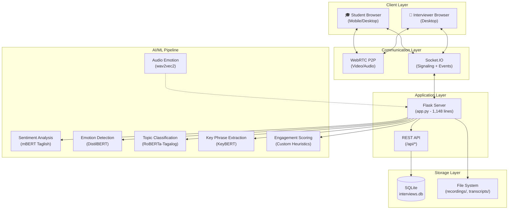
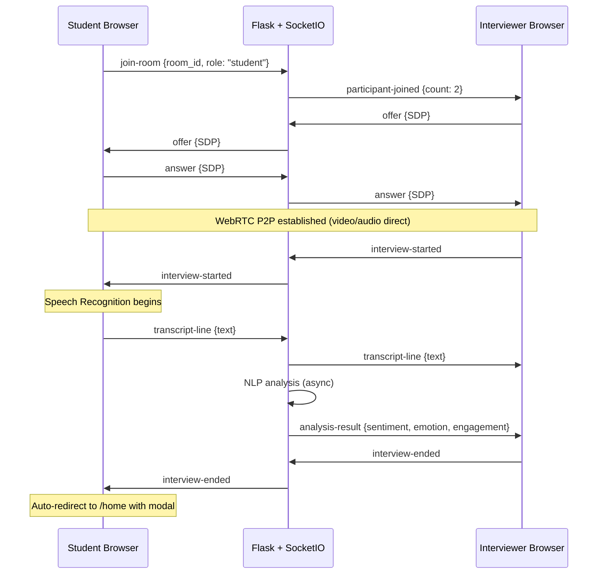
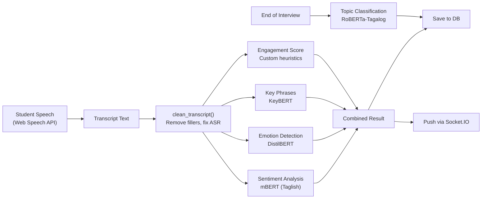
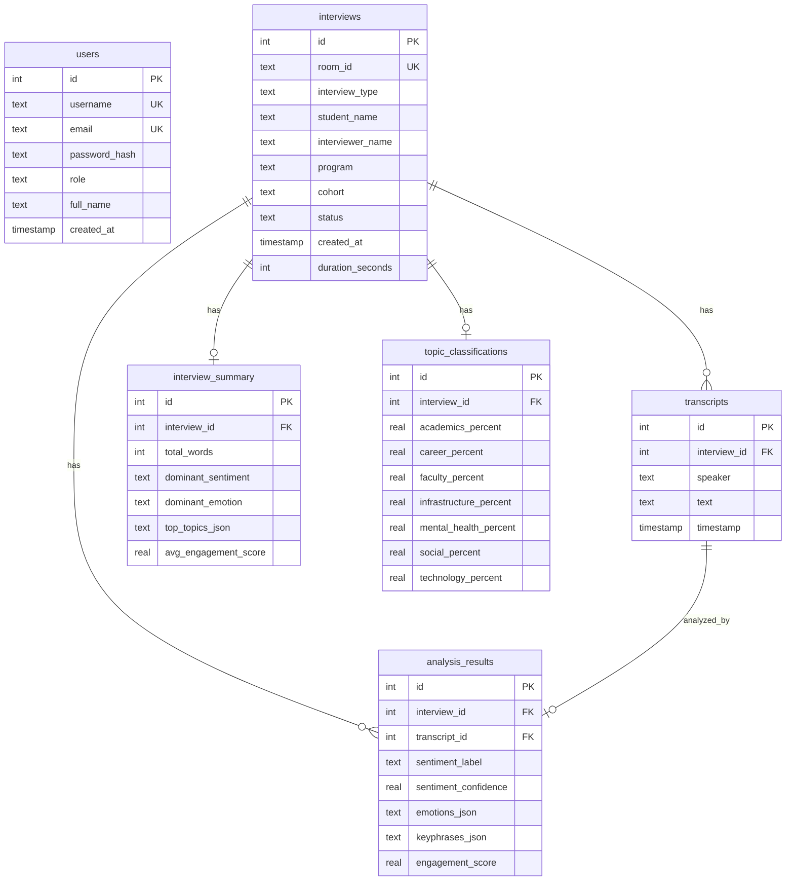

# System Architecture Analysis
**AI-Driven Admission & Exit Interview Analysis System**

---

## High-Level Overview

This is a **full-stack web application** that enables real-time video interview sessions between interviewers and students, with AI-powered analysis of the student's speech. The system performs **live sentiment analysis, emotion detection, topic classification, and engagement scoring** on student responses during interviews.

---

## Architecture Layers

### 1. Client Layer (Frontend)

| File | Purpose | Size |
|------|---------|------|
| `templates/index.html` | Student/Admin home — join room, create room | 7.6 KB |
| `templates/interview_room.html` | Live video call interface | 8.5 KB |
| `templates/dashboard.html` | Analytics dashboard (charts, tables, export) | 33.5 KB |
| `templates/interview_details.html` | Single interview deep-dive | 15 KB |
| `templates/login.html` / `register.html` | Authentication pages | 1.9 / 3.8 KB |
| `static/js/webrtc.js` | WebRTC, speech recognition, recording | 39 KB (1,103 lines) |
| `static/css/` | 5 stylesheets (style, dashboard, interview, details, auth) | ~45 KB total |

**Key frontend technologies:**
- **WebRTC** — peer-to-peer video/audio between student and interviewer
- **Web Speech API** — browser-based speech recognition (student only)
- **Chart.js** — dashboard visualizations (sentiment, trend, topic, emotion, type charts)
- **Socket.IO client** — real-time bidirectional events

### 2. Communication Layer

**Socket.IO events:**

| Event | Direction | Purpose |
|-------|-----------|---------|
| `join-room` | Client → Server | Join interview room |
| `participant-joined` | Server → Client | Notify when someone joins |
| `offer` / `answer` / `ice-candidate` | Bidirectional | WebRTC signaling |
| `interview-started` | Bidirectional | Start recording/transcription |
| `interview-ended` | Bidirectional | End call, cleanup, redirect |
| `transcript-line` | Client → Server → Client | Live transcript broadcast |
| `analysis-result` | Server → Client | Push NLP results to interviewer |

### 3. Application Layer (`app.py` — 1,148 lines)

Flask server with Eventlet WSGI, serving both HTTP routes and WebSocket events.

**REST API Endpoints:**

| Method | Endpoint | Purpose |
|--------|----------|---------|
| GET | `/home` | Student/admin landing page |
| GET | `/dashboard` | Admin analytics dashboard |
| GET | `/create-interview` | Create new room |
| GET | `/join/<room_id>` | Join existing room |
| GET | `/interview/<id>` | Interview detail page |
| POST | `/api/transcript` | Save transcript + trigger analysis |
| GET | `/api/dashboard/stats` | Aggregated dashboard data |
| GET | `/api/dashboard/recent` | Paginated recent interviews |
| POST | `/api/room/<id>/metadata` | Update interview metadata |
| POST | `/api/upload-recording` | Save recording file |
| POST | `/api/warmup` | Pre-load NLP models |
| GET | `/api/export-report` | Export Excel report |
| POST | `/login` / `/register` / `/logout` | Authentication |

**Security features:**
- CSRF protection (Flask-WTF)
- Rate limiting (Flask-Limiter)
- Password hashing (Werkzeug)
- Role-based access (admin, interviewer, student)
- Self-signed SSL certificate generation

### 4. AI/ML Pipeline

#### Module Details

| Module | Model | Purpose | Fallback |
|--------|-------|---------|----------|
| `nlp_utils.py` (658 lines) | **mBERT** (`taglish_sentiment_model_full.pth`, 711 MB) | Sentiment: Positive/Neutral/Negative | Rule-based TextBlob |
| `nlp_utils.py` | **DistilBERT** (`bhadresh-savani/distilbert-base-uncased-emotion`) | 6 emotions: joy, sadness, love, anger, fear, surprise | — |
| `nlp_utils.py` | **KeyBERT** | Key phrase extraction from transcripts | — |
| `nlp_utils.py` | Custom heuristics | Engagement score (0-10) based on word count, keywords, response length | — |
| `topic_classifier.py` (169 lines) | **RoBERTa-Tagalog** (`model/` folder, 436 MB) | 7 topics: Academics, Career, Faculty, Infrastructure, Mental health, Social, Technology | — |
| `topic_modeling.py` (350 lines) | **BERTopic** + Sentence Transformers | Unsupervised topic discovery with institutional category mapping | Keyword matching |
| `audio_emotion.py` (440 lines) | **wav2vec2** (HuggingFace) | 8 audio emotions from recordings | Feature-based (librosa) |

### 5. Storage Layer

#### Database Schema (`database.py` — 910 lines)

#### File Storage

| Directory | Contents |
|-----------|----------|
| `recordings/` | WebM video/audio recordings |
| `transcripts/` | Exported transcript files |
| `model/` | Trained RoBERTa-Tagalog model (436 MB safetensors + config) |

---

## Technology Stack Summary

| Layer | Technology | Version |
|-------|-----------|---------|
| **Backend** | Flask + Flask-SocketIO | 3.1.3 / 5.6.1 |
| **WSGI** | Eventlet (async) | — |
| **Database** | SQLite (WAL mode) | — |
| **Auth** | Flask-WTF (CSRF) + Flask-Limiter | 1.2.2 / 4.1.1 |
| **ML Framework** | PyTorch | 2.10.0 |
| **NLP** | Transformers (HuggingFace) | 5.3.0 |
| **Embeddings** | Sentence Transformers | 5.2.3 |
| **Keyphrases** | KeyBERT | 0.9.0 |
| **Audio** | Librosa + SoundFile + Pydub | 0.11.0 |
| **Frontend** | Vanilla HTML/CSS/JS + Chart.js | — |
| **Real-time** | WebRTC + Socket.IO + Web Speech API | — |
| **SSL** | pyOpenSSL (self-signed) | 25.3.0 |

---

## Data Flow Summary

1. **Interview starts** → Interviewer creates room → Student joins via room code
2. **During interview** → WebRTC handles video; Web Speech API transcribes student speech
3. **Real-time analysis** → Each transcript line is sent to the server, processed through the NLP pipeline (sentiment + emotion + keyphrases + engagement), and results are pushed back to the interviewer's sidebar
4. **Interview ends** → Topic classification runs on the full transcript; interview summary is calculated and saved
5. **Dashboard** → Admins view aggregated statistics, charts (sentiment distribution, trend over time, topic breakdown, emotion analysis), and recent interviews with search + pagination
